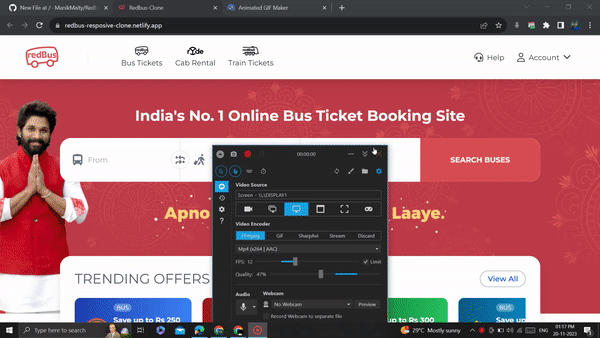

# Redbus Clone
This project is a clone of the RedBus website created using HTML and Tailwind CSS. Unlike the original RedBus desktop website, this clone is designed to be responsive for all devices.

## Table of Contents

- [Description](#description)
- [Preview](#preview)
- [Demo](#demo)
- [Features](#features)  <!-- Add Features Section -->
- [Technologies Used](#technologies-used)
- [Usage](#usage)
- [Acknowledgments](#acknowledgments)
- [Contact](#contact)

---

## Description

This project is a clone of the redbus.in website, which is a widely used platform for booking bus tickets online. It was built using HTML and Tailwind CSS, making it responsive for all devices and giving it a sleek and modern look.

---

## Preview

### Desktop Preview

### Mobile Preview

---

## Demo

[Link to Live Demo](https://redbus-resposive-clone.netlify.app/)

You can see the project in action by visiting the [live demo](https://redbus-resposive-clone.netlify.app/).

---

## Features

Here are some key features of this Redbus clone:

- **Responsive Design**: The website is designed to work seamlessly on various devices, including desktop, tablet, and mobile.

- **Modern UI**: It features a modern user interface inspired by Redbus.

- **Customizable**: You can easily customize the project to suit your needs or learn from its code structure.

- **HTML and Tailwind CSS**: Built using HTML for structure and Tailwind CSS for styling.

---

## Technologies Used

- HTML
- Tailwind CSS

---

## Usage

- Use this project to explore and understand how to create a responsive and modern web design using HTML and Tailwind CSS.
- Experiment with the code to customize and improve the Redbus clone.

---

## Acknowledgments

This project wouldn't be possible without the following:

- [Tailwind CSS](https://tailwindcss.com/) - A utility-first CSS framework.
- [Font Awesome](https://fontawesome.com/) - Icons and social logos toolkit.
- [RedBus](https://www.redbus.in/) - Inspiration for the design and functionality.
- [Google Fonts](https://fonts.google.com/) - Providing beautiful and free fonts.

---

## Contact

- Manik Maity -[manikmaity010@gmail.com]
- [My LinkedIn](https://www.linkedin.com/in/manikmaity/)

---

**Note**: This project is for educational and demonstration purposes. All assets used in the project are belongs to its respective owner, I used it for educational purpose. It is not affiliated with or endorsed by Redbus.

